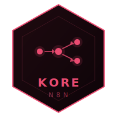

<p align="center">
  
</p>

# KORE N8N

> Socle n8n self-hosted — Docker, Traefik, Let's Encrypt, prêt à brancher sur votre domaine.
> Pas un tutoriel. Un point de départ opérationnel, documenté étape par étape.

---

## Le nom

**K** comme Kouba. **ORE** comme *core* — le socle.

Ce n'est pas un acronyme inventé après coup. Le nom est venu naturellement : une identité derrière, une philosophie devant. Construire des fondations solides avant de construire des fonctionnalités. Penser architecture avant code.

**KORE** est un écosystème de socles open source, destiné à la communauté.

---

## L'écosystème KORE

Chaque brique suit la même logique : extraite ou construite sur une base réelle, documentée, testée, utile.

| Brique | Description | Statut |
|---|---|---|
| [kore-hexagonal](https://github.com/alak8ba/kore-hexagonal) | Architecture hexagonale • 1,5 an de production réelle • 658 commits | Disponible |
| [kore-batch](https://github.com/alak8ba/kore-batch) | Traitement batch • plusieurs années de production • fort volume de données | Disponible |
| [kore-genie](https://github.com/alak8ba/kore-genie) | Socle IA privée & RAG • déploiement on-premise • zéro donnée sortante | Disponible |
| **[kore-n8n](https://github.com/alak8ba/kore-n8n)** | Automatisation self-hosted • n8n • Docker • Traefik • Let's Encrypt | Disponible |
| kore-stream | Traitement de flux temps réel | Prévu |
| kore-react | Composants frontend réutilisables | Prévu |

---

## Pourquoi ce projet existe

n8n est l'un des outils d'automatisation les plus puissants du marché. Mais le déployer correctement — reverse proxy, TLS automatique, variables d'environnement, persistance des données — demande du temps et des choix.

Ce socle extrait ces décisions une fois pour toutes. Il fournit un environnement Docker prêt à l'emploi, exposé via Traefik avec un certificat Let's Encrypt, entièrement configurable via un fichier `.env`.

---

## Stack

| Couche | Technologie |
|---|---|
| Automatisation | n8n |
| Runtime | Docker + Docker Compose |
| Reverse proxy | Traefik v2 |
| TLS | Let's Encrypt (via Traefik) |
| Base de données | SQLite (défaut) • PostgreSQL (production) |
| Configuration | Variables d'environnement (.env) |

---

## Construction • étape par étape

| # | Étape | Ce qu'on a construit |
|---|---|---|
| [01](docs/etape-01-infrastructure.md) | Infrastructure | VPS, Docker, réseau Traefik |
| [02](docs/etape-02-docker-compose.md) | Docker Compose | Service n8n, volumes, configuration |
| [03](docs/etape-03-traefik-tls.md) | Traefik & TLS | Labels, entrypoints, Let's Encrypt |
| [04](docs/etape-04-env-secrets.md) | Variables & secrets | .env, encryption key, sécurité |
| [05](docs/etape-05-premier-demarrage.md) | Premier démarrage | Vérification, logs, accès UI |
| [06](docs/etape-06-postgres.md) | PostgreSQL | Migration SQLite → PostgreSQL |
| [07](docs/etape-07-backup.md) | Backup | Sauvegarde du volume n8n_data |
| [08](docs/etape-08-mise-a-jour.md) | Mise à jour | Stratégie de montée de version |

---

## Démarrage rapide

### Prérequis

- VPS Linux avec Docker ≥ 24 et Docker Compose v2
- Traefik v2 en place, attaché à un réseau Docker `traefik_public`
- Un domaine avec un enregistrement DNS A pointant vers le VPS

### Lancer le socle

```bash
git clone https://github.com/alak8ba/kore-n8n.git
cd kore-n8n

# Configurer l'environnement
cp .env.example .env
# Éditer .env : N8N_HOST, WEBHOOK_URL, N8N_ENCRYPTION_KEY, timezone

# S'assurer que le réseau Traefik existe
docker network create traefik_public 2>/dev/null || true

# Démarrer
docker compose up -d
```

n8n est accessible sur `https://<N8N_HOST>`.

---

## Structure du projet

```
kore-n8n/
├── assets/
│   └── logo-kore-n8n.svg       # Logo du socle
├── docs/
│   ├── etape-01-infrastructure.md
│   ├── etape-02-docker-compose.md
│   ├── etape-03-traefik-tls.md
│   ├── etape-04-env-secrets.md
│   ├── etape-05-premier-demarrage.md
│   ├── etape-06-postgres.md
│   ├── etape-07-backup.md
│   └── etape-08-mise-a-jour.md
├── docker-compose.yml           # Stack n8n + labels Traefik
├── .env.example                 # Toutes les variables documentées
├── .gitignore
└── README.md
```

---

## Documentation

Voir [`docs/`](docs/) pour le détail de chaque étape.

---

## Licence

MIT — voir [LICENSE](LICENSE).
